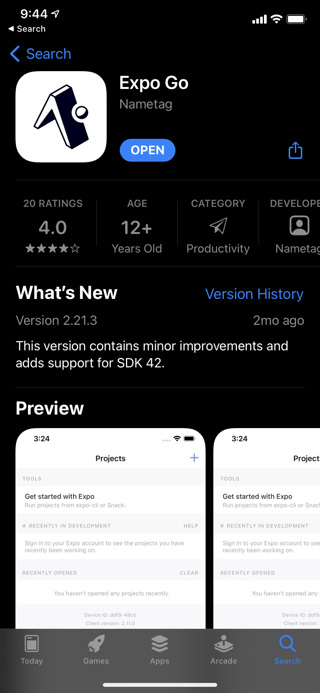
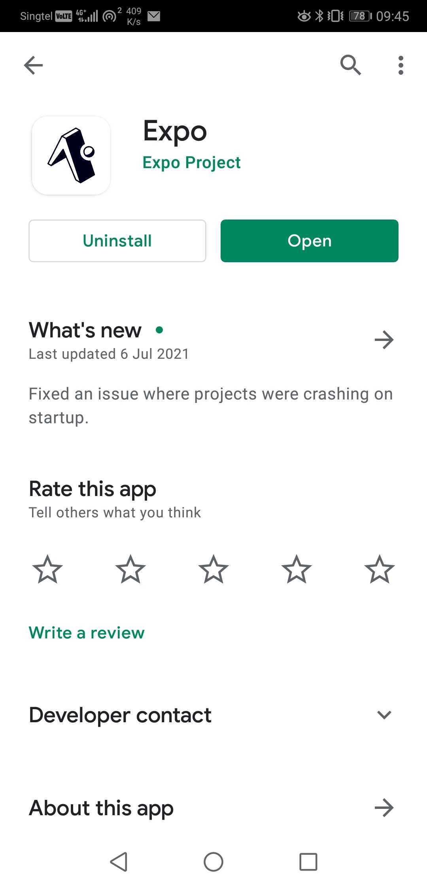
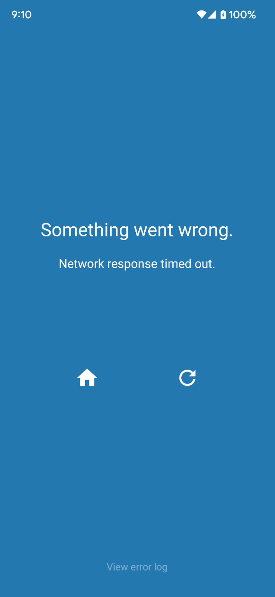
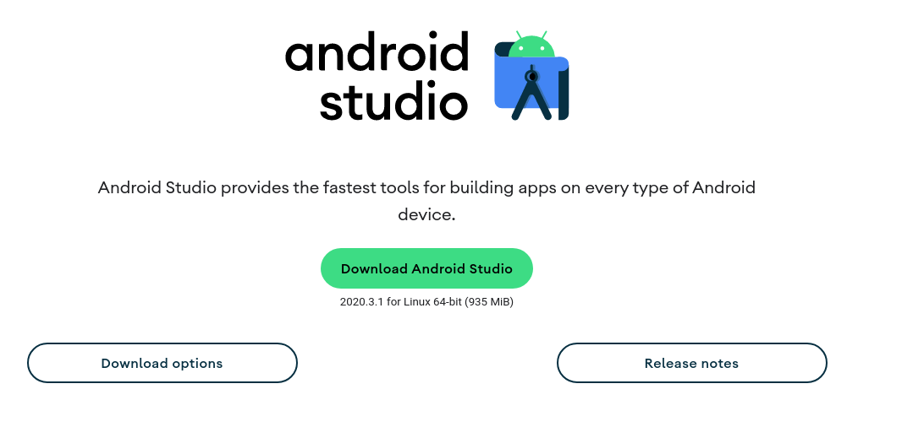
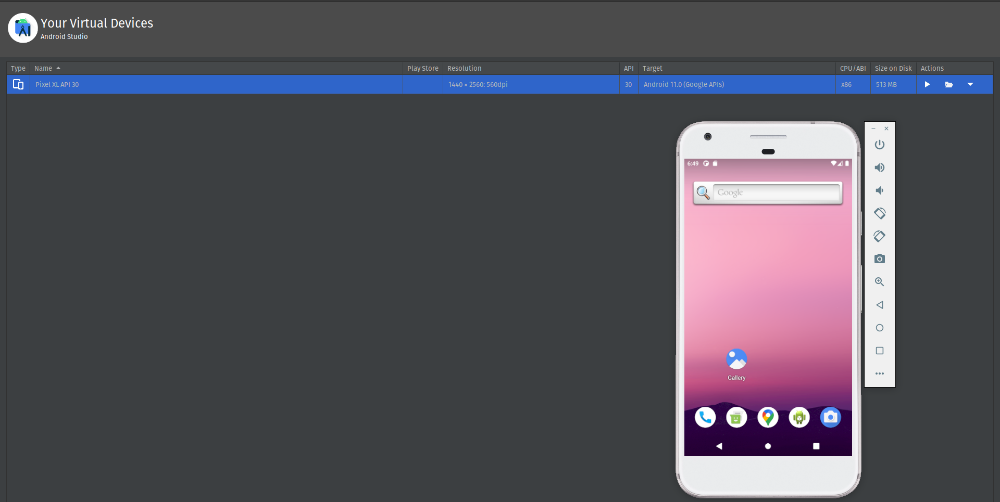
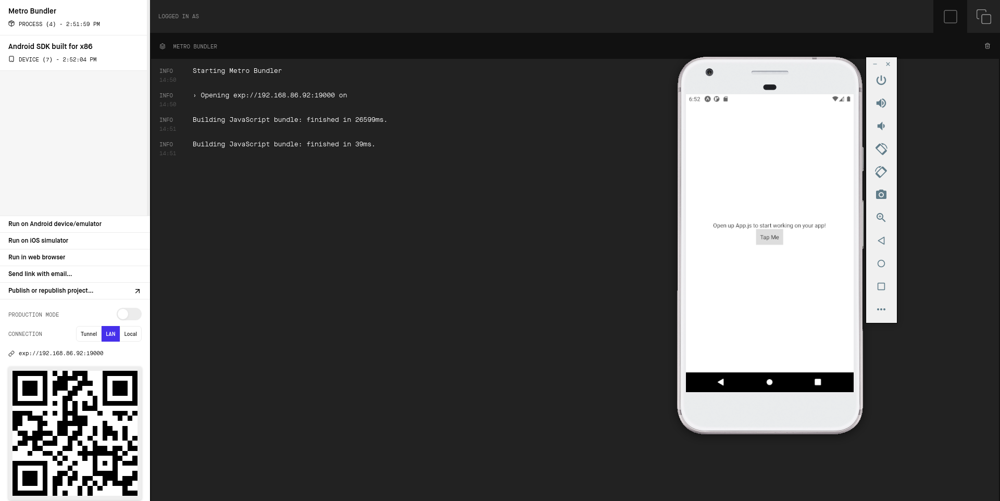
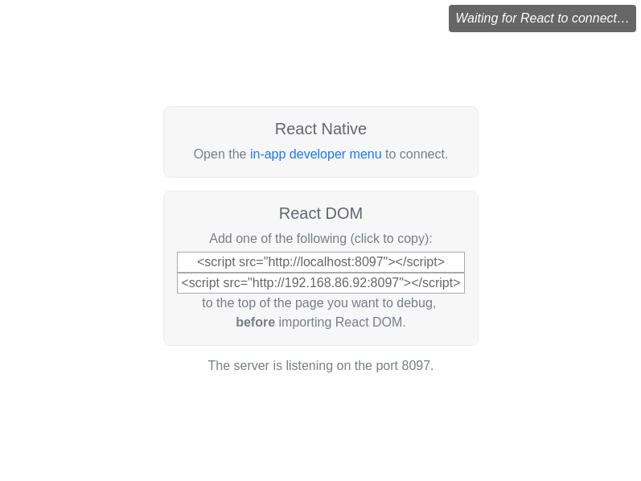
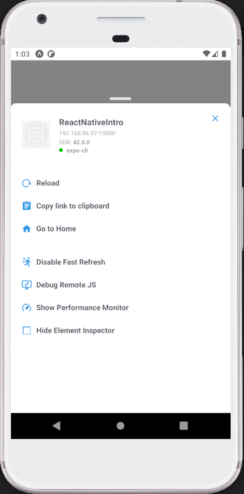
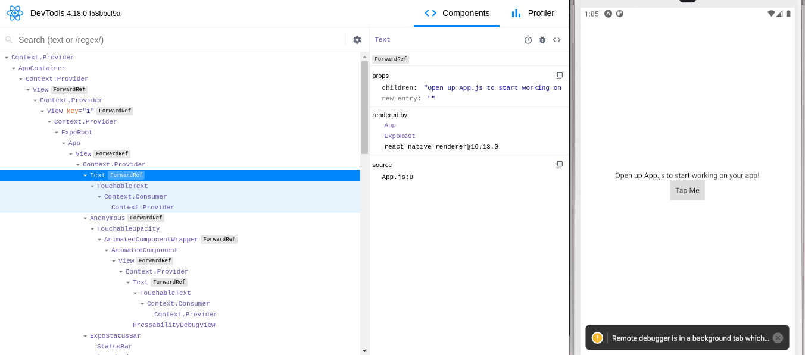

# Introduction to React Native


## Brief

In this lesson, we will setup a React Native project (and environment) together, inspect the project structure and launch a simple mobile application using Expo. Next, we will install Android simulator to allows you to test mobile applications without having the actual hardware.

## Part 1 - Expo Project Environment Setup

The following steps are excerpt from the official [environment setup guide](https://reactnative.dev/docs/environment-setup).

### Step 1: Create your React Native project. 

```
npx create-expo-app ReactNativeDemo
```

### Step 2: Start the development server

Change your current directory to the project folder and start the server.

```
cd ReactNativeDemo
npx expo start
```


### Step 3: Install Expo App (Android or iOS)

Go to your app store/google play to install this app on your mobile phone.

| App Store | Google Play |
|-----------|-------------|
|  |  |

### Step 4: Launch the App

Scan QR Code on browser with your phone (your browser should automatically launch with `http://localhost:19002/`)

If you are using Android, you might need an app like this:


After scanning the QR code, the `Expo Go` app will launch and you'll see something like this.


### Troubleshooting Tips

If you get a "Network response timed out" error message, you might try re-connecting with a tunnel option.




Press `CTRL-C` to exit the server and restart with the tunnel command:
```
npx expo start --tunnel
```

## Part 2 - Android Emulator installation

In this part of the lesson, you will be installing android emulator. Developing with React Native using emulator brings about the following benefts:

- It allows you to test multiple OS version.
- It allows you to mock device specific data, such as your current location.
- You don't have to use your real device.
- The power of being able to take screenshot and share screen with your team mates (how are you going to show your phone to your teammate via zoom?)

Note: iOS calls it `iOS Simulator` and Android calls it `Android Emulator` (FYI).

### Step 1 - Install Android Studio

Go to official android studio [download page](https://developer.android.com/studio), launch the installer package and follow the steps on screen.



If you are prompted that Java is required, download it at [here](https://www.oracle.com/java/technologies/downloads)

### Step 2 - Setup an AVD (Android Virtual Device)

Follow instructions on this [link](https://docs.expo.dev/workflow/android-studio-emulator/) to add modify PATH variables in Linux / MacOS.

For standardization, select `Pixel XL` as device, and choose the latest OS. It is `R` on the date of writing.

Once setup is done, you should see a new device being displayed on your Android Virtual Device Manager. Under the column `Actions`, click on `launch` button. Wait for android emulator to finish loading up and you should see something like this.



### Step 3 - Launch Android Emulator from Expo

Go back to the project created in your lesson, start it with `yarn start`. On the browser, you should be able to click on `Run on Android Device/Emulator` and deploy the app on your android emulator.



### Step 4: Install react-devtools package

Following this documentation, run the following command on Terminal to install `react-devtools`.

```
npm install -g react-devtools
```

Once installation completed, run this command on Terminal.

```
react-devtools
```

The development tools will begin to launch.



### Step 5: Turn on debug mode on android emulator

Go back to the android emulator, while your application is running, press `Ctrl` + `M` (Windows) or `Command` + `M` (MacOS), a window will launch. Click on "Debug Remote JS".



Next, you will observe that your `react-devtools` is connected to your android emulator.



Congratulations! You have successfully setup android emulator to develop with React Native.
